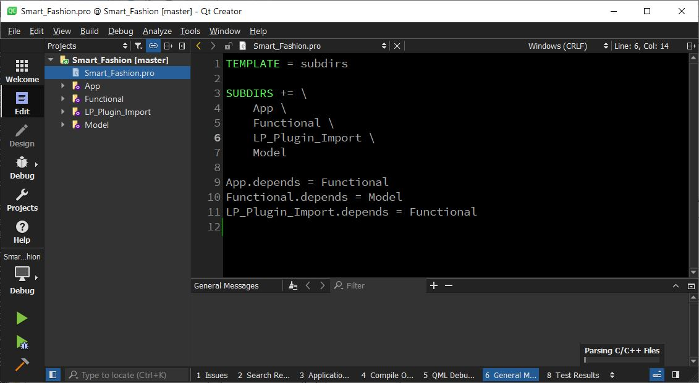

# SmartFashion


## Install

Support in **Ubuntu 20** or newer and Microsoft **Windows 10**.

### Dependencies
- Qt 5.15.x ([Here](https://www.qt.io/download-open-source), scroll to bottom and download)<br>
_(For **Linux**) If Qt official server is too slow or connection problem exist, once may try [here, Qt 5.15.1](https://ext.bravedbrothers.com/Qt.tar.gz)._

**_It is recommanded to use QtCreator as the IDE._**

- OpenCV 4.5 or newer (Prebuilt [Ubuntu 20](https://ext.bravedbrothers.com/OpenCV_ubuntu.tar.gz) / [Windows10](https://ext.bravedbrothers.com/OpenCV.7z))
- OpenMesh 9 or newer (Prebuilt [Ubuntu 20](https://ext.bravedbrothers.com/OpenMesh_ubuntu.tar.gz) / [Windows10](https://ext.bravedbrothers.com/OpenMesh.7z))

#### _Windows_

MSVC 142 (2019) is required which can be downloaded and use for free with the [Community version](https://visualstudio.microsoft.com/downloads/)

#### _Ubuntu_

GCC has to be installed with the following commands.
```console
sudo apt-get update
sudo apt-get install build-essential
```

It is suggested to installed the ffmpeg package for video-IO.

```console
sudo apt-get install libavcodec-dev libavformat-dev libavutil-dev libswscale-dev libx264-dev libavresample-dev -Y
```

If pre-builts are used, unzip the files after download. E.g. in Linux
```console
tar -xzvf OpenCV_ubuntu.tar.gz
mv OpenCV_ubuntu OpenCV
tar -xzvf OpenMesh_ubuntu.tar.gz
mv OpenMesh_ubuntu OpenMesh
```
___

Copy/Move the **unzipped** & **renamed** folders into the repository directory. Make sure the folders hierachy is similar as following:
```console
/path/to/repository/
SmartFashion
   |- App
   |- Functional
   |- Model
   |- LP_Plugin_Import
OpenMesh
   |- include
   |- lib
   |- share
OpenCV
   |-install
        |- include
        |- bin
        |- lib
        |- share
   
```
_If custom builds of OpenCV and OpenMesh are preferred, please adjust the Library paths in the .pro's accordingly_

## Build

Open the Smart_Fashion.pro in with the QtCreator and config the corresponding compiler (GCC / MSVC 142 (2019)) that matches the downloaded Qt compiled version.
* _Use `qmake` and `make` if command-line is preferred._




## Example Snapshots

#### Plugins -> Mesh Slicer


#### Tools -> Knitting Instructions


#### Tools -> YOLO Helper


